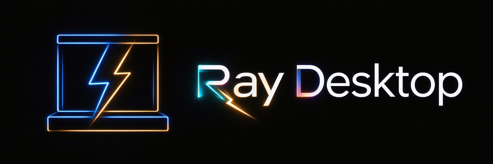
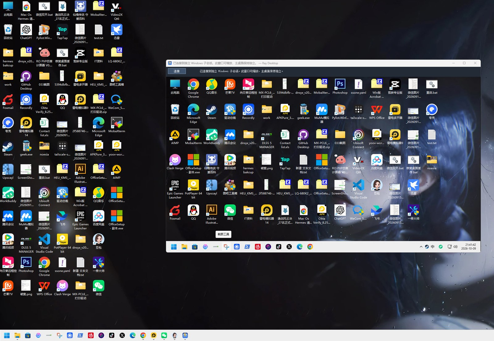

<p align="center">
  
</p>

<h1 align="center">Ray Desktop · 独立 Windows 桌面</h1>

<p align="center">
  <b>在当前登录用户的 Windows 里，用一个独立窗口操作另一个桌面会话，不影响主桌面。</b>
</p>

<p align="center">
  <a href="#快速开始">快速开始</a> ·
  <a href="#技术原理">技术原理</a> ·
  <a href="#构建">构建</a> ·
  <a href="#已知限制">已知限制</a> ·
  <a href="#许可">许可</a>
</p>

<p align="center">
  
  
  
</p>

---

**Ray Desktop** 是一个 Windows 桌面程序：主程序在一个普通窗口中显示当前 Windows 用户的 **Child Session（子会话）** 桌面。在你仍可正常使用主桌面的同时，提供了一个单独窗口来操作另一个桌面会话。

它不是虚拟机，也不是 Windows 的 `Win + Tab` 虚拟桌面。子会话和当前会话使用**同一套 Windows、内核、用户配置、文件及已安装程序**；会话中的桌面、窗口和交互状态相互独立。图像与输入通过 Microsoft Remote Desktop ActiveX 控件连接到本机子会话。

> ⚠️ 当前项目仍属**原型**。桌面连接和窗口缩放有实际运行记录；游戏、反作弊、GPU 加速等兼容性没有普遍验证。请先阅读[已知限制](#已知限制)。

## 特性

- 🖥️ **独立窗口桌面**：另开一个窗口操作子会话，主桌面照常使用
- ⚡ **免密秒开**：复用当前登录身份，基于 Windows 原生 Child Session 自动登录
- 🧩 **共享一切**：同一内核与文件系统，软件即装即用，无需单独安装
- 📋 **剪贴板互通**：文字自动重定向；文件/文件夹通过路径桥接双向复制
- 🪟 **窗口缩放**：自由调整窗口大小，远端桌面分辨率随之同步
- ⌨️ **快捷键转发**：焦点在子会话时，`Win` 组合键由子会话处理
- 🔌 **随关随清**：关闭窗口时自动注销子会话

## 界面预览

<p align="center">
  
</p>

## 快速开始

```powershell
# 1. 确认系统已开启远程桌面（Child Sessions 依赖此项）
#    设置 → 系统 → 远程桌面 → 开启

# 2. 启动（首次会弹出 UAC 启用 Child Sessions）
& '.\Raydesktop\Raydesktop.exe'
```

**首次运行流程：**

1. 启动 `Raydesktop.exe`，程序通过 `WTSIsChildSessionsEnabled` 检查子会话状态。
2. 若尚未启用，程序以 `runas` 启动同目录的 `EnableChildSessions.exe`，Windows 显示 UAC 提示。
3. 批准后，辅助程序调用 `WTSEnableChildSessions(true)` 并验证，显示结果。
4. 若功能是在**本次登录期间**刚刚启用：保存工作 → 注销 Windows → 重新登录 → 再启动主程序（辅助程序不会替你注销/重新登录）。
5. 若功能原本已启用，主程序直接连接 `localhost` 的 Child Session。

> 🔑 **首次启用后若出现凭据提示，不要输入空密码。** 取消提示，保存工作，注销并重新登录后再启动。Microsoft 文档说明 Child Session 通常自动登录，但父会话用智能卡登录、或在启用前已登录父会话时不适用。这不是为本程序设置密码。

## 技术原理

```text
WinForms 宿主启动
    │
    ├─ WTSIsChildSessionsEnabled 检查状态
    │     ├─ 未启用 → UAC 启动 EnableChildSessions.exe
    │     └─ 已启用
    │
    ├─ 创建 Microsoft RDP ActiveX 控件（CLSID 8b918b82-7985-4c24-89df-c33ad2bbfbcd）
    ├─ Server = localhost
    ├─ ConnectToChildSession = true        # 关键：连接本机子会话，而非远程电脑
    ├─ 启用 CredSSP、SmartSizing、剪贴板/驱动器重定向与 Windows 快捷键转发
    ├─ 调用 Connect()
    ├─ 监视 Connected 状态并订阅 RDP 事件
    └─ 连接完成后将宿主控件尺寸同步为子会话显示尺寸
```

核心机制是 **Windows 11 原生 Child Session 特性**：同一个 Windows 内核 fork 出并列的交互会话，共享用户配置、文件与已安装软件，因此可以免密、秒开、不顶掉主桌面。程序自身不做沙盒或虚拟化。

## 目录结构

```text
.
├─ assets/                                 # 资源文件
│  ├─ RayDesktop.ico                       # 程序图标源
│  └─ RayDesktop-preview.png               # 项目 Logo
├─ build.ps1                               # Windows 本机构建脚本
├─ LICENSE                                 # MIT 许可
├─ README.md                               # 本说明文档
├─ Raydesktop/                             # 构建输出（与 src 同级，已 gitignore，经 Releases 分发）
│  ├─ Raydesktop.exe                       # 主程序
│  ├─ EnableChildSessions.exe              # 启用功能的 UAC 辅助程序
│  ├─ MSTSCLib.dll                         # RDP COM 互操作程序集
│  └─ AxInterop.MSTSCLib.dll               # RDP ActiveX WinForms 包装程序集
└─ src/
   ├─ ChildSessionDesktop/
   │  ├─ Program.cs                        # 桌面宿主窗体、RDP ActiveX、连接与缩放逻辑
   │  └─ ClipboardFileRelay.cs             # 同一文件系统下的双向文件剪贴板桥接
   └─ ChildSessionSetup/
      ├─ Program.cs                        # 启用 Child Sessions 的管理员辅助程序源码
      └─ app.manifest                      # 要求管理员权限
```

`src\ChildSessionDesktop` 与 `src\ChildSessionSetup` 是源码目录，构建与后续开发需要保留。**一般用户运行时不需要源码目录**：应将整个 `Raydesktop` 文件夹交付给用户（见[发布](#发布)），不能只复制主 EXE。程序会在 EXE 同目录写入 `child-session.log`。

## 环境要求

### 构建机器

- Windows，且提供系统自带的 .NET Framework C# 编译器 `csc.exe`。
- Windows SDK .NET Framework 工具中的 `AxImp.exe`。构建脚本从以下位置查找：
  `C:\Program Files (x86)\Microsoft SDKs\Windows\v10.0A\bin\NETFX 4.8 Tools\AxImp.exe`
- Windows 自带的 `mstscax.dll`，脚本从 `%WINDIR%\System32\mstscax.dll` 生成 RDP ActiveX 包装程序集。
- 不需要 NuGet 包或虚拟机。

### 运行机器

- Child Sessions API 的最低客户端版本为 Windows 8、最低服务器版本为 Windows Server 2012；但并非所有 Windows 版本/版本类型/策略/账户状态都能连接，目标机需逐台确认。参见 [Microsoft Child Sessions 文档](https://learn.microsoft.com/windows/win32/termserv/child-sessions)。
- 需要允许程序连接本机 Child Session；首次启用时需管理员通过 UAC。
- 运行依赖文件需和主程序放在同一文件夹。

## 构建

在项目根目录打开 PowerShell：

```powershell
.\build.ps1
```

成功后会生成/更新：

```text
Raydesktop\Raydesktop.exe
Raydesktop\EnableChildSessions.exe
Raydesktop\MSTSCLib.dll
Raydesktop\AxInterop.MSTSCLib.dll
```

脚本会在系统临时目录生成 ActiveX 互操作程序集，在宿主输出目录先写临时 EXE 再发布成最终文件；无论成功或失败都会清理临时文件。启动：

```powershell
& '.\Raydesktop\Raydesktop.exe'
```

如需重新编译某一份拷贝，应在具备上述构建工具的 Windows 开发环境中保留整个项目目录。

## 发布

建议用 GitHub **Releases** 分发，而不是把构建产物提交进仓库（`.gitignore` 已排除 `Raydesktop`）。每次发版：

1. 在开发机运行 `build.ps1` 得到四个交付文件。
2. 将整个 `Raydesktop` 目录打包成 ZIP 上传为 Release 资产。
3. 在 Release 说明中标注目标 Windows 版本与已验证的范围。

## 运行时工作流程

### 连接状态

程序读取 `IMsRdpClient9.Connected`：

- `0`：未连接/已断开。
- `1`：已连接。
- `2`：连接中。

状态每 750 毫秒检查一次；连接超过 45 秒仍处于连接中时，程序尝试断开并在状态栏提示超时。RDP 控件的断开、致命错误和登录错误事件会记录错误码。点击连接按钮会再次检查；若已连接或正在连接，不会重复调用 `Connect()`。

### 窗口缩放

RDP 控件大小改变后，程序等待约 300 毫秒合并连续尺寸变化，再调用 `UpdateSessionDisplaySettings` 更新远端桌面尺寸。收到已连接状态后约 2 秒发送首次显示设置；若更新失败，按 500/1000/2000/4000 毫秒间隔重试。窗口最小 `640×400`；显示尺寸限制在 200–8192 像素，宽度调整为偶数。

> 宿主窗口仍可缩放；若远端 RDP 图形通道不支持动态显示更新，内容可能只缩放而桌面分辨率不变。不同 Windows 版本与图形驱动需实际验证。

### 剪贴板与文件复制

文字和常规剪贴板格式继续使用 RDP ActiveX 的自动剪贴板重定向。文件/文件夹使用**本机路径桥接**——两个会话共享用户配置与文件系统，但剪贴板彼此独立。用户仍在资源管理器中右键复制/粘贴或 `Ctrl+C`/`Ctrl+V`，无需额外按钮。

实现流程：

1. 宿主窗体使用自身窗口句柄，Child Session 内的代理使用不可见消息窗口，均通过 `AddClipboardFormatListener` 接收剪贴板变更通知。代理由同一 EXE 用 `--clipboard-agent --parent-session <会话 ID>` 参数启动。
2. 代理只处理 Windows 标准 `CF_HDROP` 文件路径列表。新剪贴板内容编码为消息 ID 与路径列表，写入 `%LOCALAPPDATA%\ChildSessionDesktop\ClipboardBridge` 下的 `host-to-child.bin` / `child-to-host.bin`。先写唯一临时文件再原子替换，避免另一侧读到半条消息。
3. 另一会话每 250 毫秒检查信箱，收到后通过 `Clipboard.SetFileDropList` 设置标准文件剪贴板格式。消息 ID、路径指纹与剪贴板序列号用于去重与抑制回传回环；剪贴板被其他程序占用时由定时器继续重试。
4. 文件内容本身不经过桥接——两侧使用相同本机路径，资源管理器直接访问同一文件；这是路径列表同步，不是字节传输。

程序在当前用户的 `HKCU\...\Run` 注册隐藏代理启动参数，不需要管理员权限；登录时代理仅在非主控制台且不同于注册时宿主会话的会话启动。关闭宿主窗口时程序请求注销 Child Session，并清除信箱中的两条消息。

支持资源管理器可表示为本地路径的文件/文件夹；不支持邮件附件等无本机路径的虚拟文件对象。关闭程序后 Run 注册项仍保留，便于下次 Child Session 登录时启动代理；代理在主控制台会话会立即退出。

### Windows 快捷键

连接前设置 `KeyboardHookMode = 1` 将 Windows 键盘组合发送到子会话，并启用 `EnableWindowsKey` 与 `AcceleratorPassthrough`。焦点在子会话画面内时，`Win`、`Win + R` 等组合由子会话处理；焦点不在 RDP 画面时，快捷键仍由主桌面处理。`KeyboardHookMode` 不能连接后修改，故在 `Connect()` 前设置。

### 关闭程序

关闭宿主窗体时，程序先调用 `Disconnect()`，再通过 `WTSGetChildSessionId` 获取子会话 ID 并调用 `WTSLogoffSession` 注销子会话。子会话中的程序会随注销结束，请先保存未保存的工作。注销请求异步提交，日志记录是否提交成功；Windows 会话管理器完成实际清理。

## 关键实现位置

### `src\ChildSessionDesktop\Program.cs`

- `Program.Log`：将运行时间与诊断信息追加到 EXE 同目录的 `child-session.log`。
- `DesktopForm.LogRedirectionDiagnostics`：连接后记录 RDP 剪贴板与磁盘重定向状态，并记录本机文件路径桥接已启动。
- `Program.WTSIsChildSessionsEnabled`：从 `wtsapi32.dll` 导入状态检测 API。
- `Program.WTSGetChildSessionId` / `WTSLogoffSession`：关闭宿主窗口时定位并注销 Child Session。
- `DesktopForm.ConnectChildSession`：检查启用状态、配置 RDP COM 对象、打开剪贴板重定向并开始连接。
- `DesktopForm.RequestEnableChildSessions`：通过 UAC 启动管理员辅助程序。
- `DesktopForm.UpdateConnectionStatus`：读取 RDP 连接状态并处理连接超时。
- `DesktopForm.HandleDisconnected` / `HandleFatalError` / `HandleLogonError`：处理 RDP 事件并更新状态栏/日志。
- `DesktopForm.QueueDisplayResize` / `ApplyDisplaySize`：防抖、发送显示尺寸与失败重试。
- `ChildSessionControl`：以 RDP ActiveX CLSID `8b918b82-7985-4c24-89df-c33ad2bbfbcd` 承载远程会话。

### `src\ChildSessionDesktop\ClipboardFileRelay.cs`

- `ClipboardFileRelay`：监听 `CF_HDROP` 剪贴板变化，读写双向信箱、应用文件路径列表并抑制回环；不复制文件数据。
- `ClipboardAgentContext` / `ClipboardAgentWindow`：在 Child Session 内运行无界面代理窗口与 250ms 信箱轮询。
- `RegisterChildAgent` / `ShouldRunChildAgent`：注册当前用户启动项，并避免代理在主控制台或父会话常驻。

### `src\ChildSessionSetup\Program.cs`

调用 `WTSEnableChildSessions(true)` 启用功能，并用 `WTSIsChildSessionsEnabled` 检查结果；`app.manifest` 声明 `requireAdministrator`，运行时由 Windows 显示 UAC。

## 日志与故障排查

日志位置：`Raydesktop.exe 同目录\child-session.log`（UTF-8 BOM，便于记事本显示中文）。日志可能含连接时间、状态变化、系统错误码与异常文本；提交给开发者前可先遮盖用户名、计算机名等个人信息。

首次使用时，宿主程序会尝试写入当前用户的 Run 启动项；Child Session 登录时 Windows 再尝试启动隐藏代理。需要在宿主与 Child Session 两侧各做一次文件/文件夹复制粘贴验证。若日志出现 “Registered the automatic child-session file clipboard bridge” 但没有 “Child-session file clipboard agent started”，只能说明日志中没有代理启动记录；还需检查 Run 项命令、代理进程所在会话及系统策略/安全软件，不能仅凭缺少该日志判断启动项被拦截。

| 现象/日志 | 含义与处理 |
|---|---|
| `Child sessions are disabled on this computer` | 功能未启用。检查是否出现 UAC；确认辅助程序与主程序放在一起。启用后若仍不能登录，注销并重新登录 Windows。 |
| 出现账号/密码提示，空密码被拒绝 | 若本次登录期间刚启用 Child Sessions，取消提示，注销并重新登录后再启动。不要为绕过提示设置或保存密码。 |
| `0x00000C07` | Microsoft 定义为 `SSL_ERR_ACCOUNT_RESTRICTION`（账户受限）。确认启用与注销/重新登录流程已完成，并检查账户与策略；该码不能单独证明是空密码导致。参见 [OnDisconnected](https://learn.microsoft.com/windows/win32/termserv/imstscaxevents-ondisconnected)。 |
| `0x00000001` | Microsoft 定义为本地断开，且不是错误码。若在连接建立前出现，不能据此判断子会话是否曾短暂建立；结合前后日志与 `Connected` 状态排查。 |
| 连接状态长期为 `2` | 45 秒后提示超时。检查 Windows 版本、Child Sessions 状态、登录时机与系统策略。 |
| `UpdateSessionDisplaySettings` 返回 `0x8000FFFF` | 动态分辨率更新失败。程序会延迟并重试；查看后续是否有 `Remote desktop resized to 宽x高`。 |
| Windows 正在继续登录 | Child Session 登录过程中的正常通知，不代表失败；程序按信息事件处理。 |
| “缺少管理员启用程序” | 交付不完整。重新复制整个 `Raydesktop` 文件夹。 |
| COM/ActiveX 创建失败 | 确认 Windows 自带 `mstscax.dll` 可用、程序与 DLL 在同目录，并在目标 Windows 版本上重新构建/验证。 |

对于断开码，微软建议使用 RDP 控件 `GetErrorDescription` 结合 `ExtendedDisconnectReason` 获取具体描述；当前版本尚未实现该扩展诊断。

## 安全与隐私

- 子会话与主会话属于**同一 Windows 用户环境，不是安全边界**。两边共享用户数据、软件安装、内核及可访问资源。
- 管理员辅助程序需要 UAC 授权才能启用 Child Sessions。
- 程序不会要求或保存 Windows 密码；日志只写在程序目录。
- 若在多人共用或受管理的电脑上部署，应先确认管理员策略允许启用该功能，并由设备所有者处理授权。

## 已知限制

- 这是通过本机 RDP ActiveX 显示的 Child Session，不是 `Win + Tab` 虚拟桌面，也不是 Hyper-V 虚拟机。
- 所有依赖当前交互桌面、控制台会话或特定显卡路径的程序不保证可用。
- 游戏、反作弊、GPU 加速、独占全屏、Raw Input、DRM 视频、摄像头和音频重定向尚未全面验证。
- 同一 Windows 用户、系统版本、组策略与 Child Sessions 启用时机都会影响免密连接；不能承诺复制程序到任意电脑后即刻可用。
- 当前没有安装包/自动更新、设置页、详细的 RDP 错误描述、分辨率配置或会话管理界面。
- 若需求是可靠的隔离环境、独立 GPU/游戏兼容性或跨设备一致性，应评估 Hyper-V 虚拟机、Windows Sandbox 或独立 Windows 账户等方案。

### 游戏兼容性

动态分辨率对**办公场景**可靠：桌面、壁纸与普通窗口由操作系统按当前分辨率实时重渲染，铺满且不变形。**游戏是例外**：无边框窗口化的游戏渲染自己固定的内部分辨率缓冲，窗口缩放时它不重新渲染而是直接拉伸，导致 UI 变形、鼠标错位。能否在子会话里调分辨率/全屏**取决于游戏本身**——有的可以，有的（如巫师3）不提供该选项，所以不要依赖"选全屏/挑分辨率"。

**游戏唯一规则（定死）：先定窗口，再开游戏，玩时别拉窗口。**

1. 开游戏**前**，把 Ray Desktop 窗口拖到你想要的大小。
2. 再启动游戏，游戏画面自动跟随当前窗口尺寸。
3. 游玩期间**不要缩放** Ray Desktop 窗口；要换大小，先退出游戏，调好窗口再进。

**游戏启动失败的常见坑**：游戏保存的显示配置若为"全屏 + 非当前显示器支持的整屏分辨率"，会因找不到对应全屏模式而启动失败。例如文明6 的 `%LOCALAPPDATA%\Firaxis Games\Sid Meier's Civilization VI\AppOptions.txt` 中 `FullScreen 1` 且 `RenderWidth/Height` 与当前显示器模式不匹配时，游戏会报 `Unable to find correct DXGI mode` 而进不去。恢复办法：把该文件 `FullScreen` 改为 `0`（窗口模式），或设为当前显示器支持的整屏分辨率后重启游戏。

## 开发与验证建议

1. 修改宿主程序时编辑 `src\ChildSessionDesktop\Program.cs`；修改启用逻辑时编辑 `src\ChildSessionSetup\Program.cs` 或清单。
2. 在 Windows 开发机运行 `build.ps1`，确认四个交付文件均生成在 `Raydesktop`。
3. 在目标 Windows 版本的独立测试电脑上验证：首次 UAC 启用、注销后连接、断开重连、窗口缩放、关闭宿主，以及日志诊断。
4. 修改 RDP COM/ActiveX 设置后，优先在测试环境验证连接状态与错误事件；不要只依据 `Connect()` 返回认定会话成功，最终应观察 `Connected=1` 及远端桌面是否可交互。
5. 发布时交付整个 `Raydesktop` 目录，并在每个目标 Windows 版本上单独验证兼容性。

## 许可

[MIT](LICENSE) © [raydoomed](https://github.com/raydoomed)

## 作者

维护者：[raydoomed](https://github.com/raydoomed)
